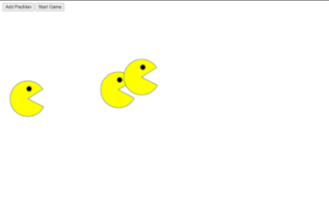

<H1>Title:</H1>
Pacman Factory
 

 

<H1>Description:</H1>
Allows users to add pacmen on the screen with the <u>Add Pacman</u> button and press a <u>Start Game</u> button to make them move. With the added collision function, they bounce off the sides of the screen.
 

<H1>License information:</H1> 
MIT license. Open source.
